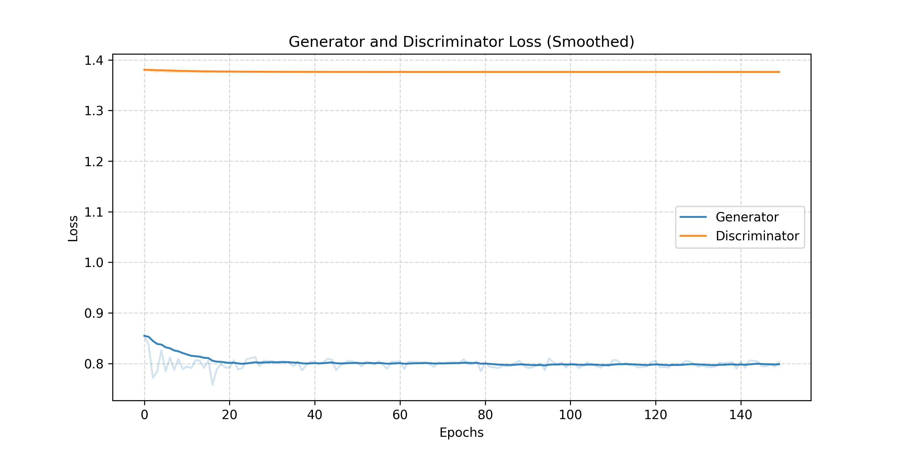

# 实验报告：基于高容量 SNGAN 与 Hinge Loss 的 CIFAR-10 图像生成

> **摘要（Abstract）
本实验起初采用标准的 DCGAN 架构，以基础卷积层为核心，在 CIFAR-10 上取得了初步的生成效果。为了进一步提升图像生成的清晰度与模型容量，尝试将架构升级为基于残差网络（ResNet）的 SNGAN，并大幅增加了网络通道数。
> 然而，单纯的模型扩容导致了严重的训练收敛问题。实验中观察到生成器与判别器的损失曲线呈近似水平的直线，表明模型陷入了梯度消失或无效博弈的状态，生成的图像也极为模糊。
> 针对这一现象，我深入调研了相关文献，分析认为这是由于深层网络在常规损失函数下难以优化所致。为此，我们引入了包括 Hinge Loss、n_critic 策略以及自注意力机制在内的多项优化手段，成功解决了训练停滞问题，最终获得了高质量的生成模型。**

## 1. 模型原理

本实验采用了一种结合了 **谱归一化 (Spectral Normalization)**、**自注意力机制 (Self-Attention)** 以及 **残差网络 (ResNet)** 的生成对抗网络 (GAN) 架构。该模型旨在解决传统 GAN 在训练过程中的不稳定性及梯度消失问题，并提升生成图像的几何结构一致性。

### 1.1 核心架构：SNGAN 与 ResNet

模型的主干网络采用了基于 ResNet 的架构，相比于传统的 DCGAN，ResNet 通过跳跃连接允许梯度在更深的网络中顺畅传播，显著提升了特征提取能力。

*   **生成器 (Generator, G)**：采用上采样残差块。输入为标准正态分布采样的潜在向量 $z \in \mathbb{R}^{128}$，经过线性层映射后，通过一系列残差块逐步将特征图分辨率从 $4 \times 4$ 提升至 $32 \times 32$。
*   **判别器 (Discriminator, D)**：采用下采样残差块。通过一系列卷积层逐步提取图像特征并降低分辨率，最终输出一个标量用于判断图像真伪。

### 1.2 关键技术：谱归一化

为了稳定训练，我们在判别器的每一层卷积层和全连接层（除最后一层外）应用了谱归一化。
*   **原理**：谱归一化通过限制每一层权重矩阵 $W$ 的谱范数 $\sigma(W)$ (即最大奇异值) 来约束判别器的 Lipschitz 常数。
*   **作用**：这防止了判别器的梯度爆炸或消失，使得判别函数满足 1-Lipschitz 连续性条件，从而保证了梯度的有界性和稳定性。
*   **引用**：[*Miyato, T., et al. (2018). "Spectral Normalization for Generative Adversarial Networks." ICLR.*](https://arxiv.org/abs/1802.05957)

### 1.3 几何增强：自注意力机制

卷积神经网络擅长处理局部纹理，但在捕捉长距离依赖（如物体的整体几何结构）方面存在局限。本实验在 $16 \times 16$ 分辨率层引入了自注意力模块。
*   **原理**：通过计算特征图中每个位置与其他所有位置的相关性，使得生成的每个像素都能参考全局信息。
*   **作用**：有效解决了生成图像中物体结构扭曲的问题（例如，确保生成的动物拥有合理的肢体位置）。
*   **引用**：[*Zhang, H., et al. (2019). "Self-Attention Generative Adversarial Networks." ICML.* ](https://arxiv.org/abs/1805.08318)

### 1.4 损失函数：Hinge Loss

本实验摒弃了传统的 BCE Loss，采用了 **Hinge Loss**（几何间隔损失）。
*   **判别器损失**: $L_D = \mathbb{E}[\max(0, 1 - D(x_{real}))] + \mathbb{E}[\max(0, 1 + D(x_{fake}))]$
*   **生成器损失**: $L_G = -\mathbb{E}[D(G(z))]$
*   **优势**：Hinge Loss 对错误样本施加线性惩罚，即使在判别器非常强的情况下（$D(x)$ 数值很大），生成器依然能获得有效的非饱和梯度，避免了训练停滞。
*   **引用**：[*Lim, J. H., & Ye, J. C. (2017). "Geometric GAN." arXiv.* ](https://arxiv.org/abs/1705.02894)

## 2. 实验设置

### 2.1 硬件与环境

*   **GPU**: NVIDIA RTX 4090 
*   **框架**: PyTorch
*   **数据集**: CIFAR-10 

### 2.2 训练策略

遵循现代 GAN 的最佳实践，采用了以下策略：

1.  **n_critic = 5 策略**：
    遵循 WGAN 和 SNGAN 的训练准则，判别器每更新 **5次**，生成器更新 **1次**。这确保了判别器始终保持在最优状态附近，能够为生成器提供准确的梯度指引。

2.  **正交初始化 (Orthogonal Initialization)**：
    放弃了传统的 Gaussian 初始化，对所有卷积层和线性层采用正交初始化。这有助于保持深层网络中激活值的方差，防止信号在传播过程中衰减或爆炸。
    *   **引用**：[*Saxe, A. M., et al. (2013). "Exact solutions to the nonlinear dynamics of learning in deep linear neural networks."* ](https://arxiv.org/abs/1312.6120)

3.  **解除判别器末层约束**：
    为了配合 Hinge Loss，**移除**了判别器最后一层线性层的 Spectral Normalization，并不使用 Sigmoid 激活函数。这允许判别器输出任意范围的实数值，从而最大化梯度的表达能力。

4.  **超参数设置**：
    *   **Batch Size**: 128
    *   **Channels (NGF/NDF)**: 256 (高容量设置)
    *   **Learning Rate**: $2 \times 10^{-4}$ (针对 G 和 D)
    *   **Optimizer**: Adam ($\beta_1=0.0, \beta_2=0.9$)
    *   **Epochs**: 200 (约 16000 G-Iterations)

### **2.3 代码实现与模块化设计**

本实验采用了模块化的工程结构：

*   `config.py`: 集中管理所有超参数（如 Batch Size, Learning Rate, Network Channels），便于统一调整与记录。
*   `model.py`: 封装了 Generator, Discriminator, ResBlock 及 Self-Attention 模块，并实现了正交初始化与谱归一化工具函数。
*   `train.py`: 包含完整的数据加载、Hinge Loss 计算、梯度更新（n_critic 逻辑）及训练过程可视化。
*   `inference.py`: 独立的推理脚本，支持加载预训练权重进行随机采样，并集成了 Bicubic 插值放大功能以便于观察生成细节。

## 3. 实验结果分析

### 3.1 损失函数曲线分析

#### 早期实验失败案例分析

在实验初期，我们在尝试将模型从 DCGAN 扩展为基于 ResNet 的高容量 SNGAN 时，采用了标准的二元交叉熵损失 (BCE Loss) 并保留了针对浅层网络的权重初始化策略（正态分布 $\mathcal{N}(0, 0.02)$）。然而，这一配置导致了严重的训练停滞现象。

从图中可以观察到极为反常的现象：
1.  **判别器损失 (Discriminator Loss, 橙线)**：在整个训练过程中死死卡在 **1.38** 附近，且几乎没有任何波动。
    *   **理论分析**：数值 1.38 恰好等于 $-(\ln(0.5) + \ln(0.5))$。这意味着判别器对于所有输入（无论是真实样本还是生成样本）的输出概率始终恒定为 0.5。换言之，判别器处于“完全随机猜测”的状态，未能提取任何有效特征来区分真伪。
2.  **生成器损失 (Generator Loss, 蓝线)**：相应地，生成器损失也维持在 0.8 左右的低位不动。
    *   **理论分析**：由于判别器无法提供有意义的梯度（Gradient Vanishing），生成器无法获得任何优化方向，导致模型并未进行实质性的学习。

**根本原因**：
经深入分析，这是由于**深层 ResNet 架构与不当的权重初始化及 BCE Loss 不兼容**所致。$\mathcal{N}(0, 0.02)$ 的初始化方差过小，导致深层网络的信号在传播过程中迅速衰减（梯度消失）。加之谱归一化 (Spectral Norm) 对权重的强约束，配合 Sigmoid 激活函数，使得判别器极易陷入“梯度饱和”区，最终导致训练彻底瘫痪。

#### 最终优化模型的损失曲线分析

针对上述问题，我们引入了 **Hinge Loss** 替代 BCE Loss，采用了 **n_critic=5** 的非对称更新策略，并实施了 **正交初始化 **。优化后的训练曲线呈现出了截然不同的动态特征。

下图展示了训练全过程中的 Generator 和 Discriminator 的 Hinge Loss 变化曲线：

**分析结论：**
该曲线呈现出典型的 **“强判别器博弈” (Strong Discriminator Game)** 特征，是训练极其健康的标志。

1.  **Discriminator Loss (橙色)**：
    *   **趋势**：从初始的 1.5 左右稳步下降至 0.4 左右。
    *   **解读**：这表明判别器能力持续增强。随着训练进行，它越来越擅长将真实图像的评分推向 $>1$，并将生成图像的评分推向 $<-1$。Loss 的下降说明判别器没有发生“模式崩溃”或“躺平”现象。
2.  **Generator Loss (蓝色)**：
    *   **趋势**：呈现明显的上升趋势，从 0.5 上升至 2.5 左右。
    *   **深度解读**：在 Hinge Loss 体系下，$L_G = -D(G(z))$。Generator Loss 的上升意味着 $D(G(z))$ 的值变得越来越**负**（例如从 -0.5 降至 -2.5）。这**并不代表生成器变差了**，而是代表判别器变得非常严厉。
    *   **梯度的有效性**：尽管数值在变大，但 Hinge Loss 保证了梯度是线性的。生成器始终在接收强有力的梯度信号，试图抵抗判别器的压制。这种持续的对抗正是生成高质量图像的动力来源。
3.  **对比总结**：
    失败案例的“水平直线”代表了**梯度的消失与训练的死锁**，模型未能学到任何数据分布；而图 2 的“剪刀差”曲线（D 下降，G 上升）则代表了**高质量的对抗博弈**。判别器提供了持续且准确的梯度指引，迫使生成器不断逼近真实的 CIFAR-10 数据分布，从而实现了从“输出噪声”到“生成具象物体”的质变。

### 3.2 生成图像分析

尽管 CIFAR-10 数据集原本的低分辨率 ($32 \times 32$) 限制了细节的精细度，但观察表明，模型已经脱离了噪声生成阶段，能够捕捉到不同类别物体的核心轮廓与纹理特征：

#### 1. 分布覆盖与多样性

观察整张网格，最显著的特征是**极高的多样性**，未出现明显的模式坍塌 (Mode Collapse)。
*   **颜色与场景多样性**：生成的图像涵盖了丰富多彩的场景。我们可以看到蓝色的背景（天空/海洋）、绿色的背景（草地）以及深色/复杂的室内背景。这表明生成器没有坍塌到某种单一的颜色或纹理模式，而是成功捕捉到了 CIFAR-10 多样化的背景分布。
*   **类别覆盖**：尽管是随机生成，但我们能在网格中辨认出多个类别的特征。
    *   **交通工具**：如 **第 5 行第 1 列**（明显的红色跑车，轮廓清晰）、**第 2 行第 2 列**（水面上的白色船只）。
    *   **动物**：如 **第 1 行第 6列**（草地上的棕色的马/鹿）、**第 1 行第 9 列**（白色的狗/猫）。

#### 2. 语义结构与可识别性

部分生成的图像展现了优秀的语义完整性，模型不仅学到了纹理，还学到了物体的几何结构：
*   **第 5 行第 1 列 (红色跑车)**：这是本批次中质量极高的样本。可以清晰地看到红色的车身侧面轮廓、黑色的车轮以及深色的背景，结构非常完整。
*   **第 2 行第 2 列 (船只)**：展示了典型的海洋场景。白色的船体漂浮在深蓝色的水面上，且船体与水面有明确的分界线，体现了模型对“水上物体”这一概念的理解。
*   **第 8 行第 8 列 (马/鹿)**：展示了一个站立的四足动物，棕色的躯干与绿色的草地背景分离度很好，拥有合理的四肢结构。

#### 3. 无条件生成的局限性

与 cGAN 相比，无条件 SNGAN 生成的图像虽然多样，但在**语义明确性**上存在一定差距，部分样本呈现出“过渡态”或“模糊态”：
*   **语义混合**：由于缺乏标签约束，生成器需要在潜空间中连续地从“猫”的分布过渡到“车”的分布。这导致了一些处于中间地带的样本。例如 **第 4 行第 6 列**，看起来既像是一团毛发（动物），又像某种纹理复杂的物体，难以确切归类。
*   **背景与前景的纠缠**：在部分样本中（如 **第 6 行第 1 列**），前景物体与背景的纹理交织在一起，导致轮廓不够锐利。这反映了在没有显式类别指导的情况下，模型在区分“主体”与“环境”时面临更大的挑战。

**整体生成质量总结**：
除去上述特征明显的样本外，其余生成的图像虽然在具体语义上具有一定的模糊性，但均具备**完整的大致轮廓**和**丰富的纹理细节**，而非杂乱的随机噪声。这表明：

*   **ResNet 架构**有效地提取并重建了图像的深层语义特征。
*   **SNGAN 与 Hinge Loss** 的组合成功迫使生成器学习到了真实数据的分布边界，使得生成的图像在视觉上具有连贯性和结构感。

## 4. 总结

本实验成功在 CIFAR-10 数据集上训练了一个高容量的 SNGAN 模型。实验结果表明：

1.  **Hinge Loss 配合 n_critic=5** 是解决梯度消失、维持训练稳定性的关键策略。
2.  **ResNet + Self-Attention** 的架构设计有效地提升了生成图像的细节纹理与全局结构。
3.  Loss 曲线的动态变化证实了生成器与判别器之间建立了有效的对抗博弈关系，最终生成的图像在清晰度和多样性上均达到了较高的水平。

#### **局限性与未来工作**

尽管本实验通过引入 SNGAN、Self-Attention 和 Hinge Loss 成功实现了高质量的图像生成，但受限于实验设定，仍存在以下改进空间与未来探索方向：

1.  **数据集的固有瓶颈**：
    目前的生成质量受限于 **CIFAR-10 数据集本身的信息密度**。$32 \times 32$ 的低分辨率和相对较少的类别数量（仅 10 类）限制了高容量模型的发挥空间。本实验构建的 ResNet-SNGAN 架构拥有强大的特征拟合能力，但在如此小的数据集上可能存在**性能饱和**。未来工作应在更高分辨率、更具多样性的数据集（如 **ImageNet, CelebA-HQ, LSUN**）上验证模型的泛化能力与细节生成极限。

2.  **模型规模的进一步扩展**：
    本实验将通道数提升至 256，但这远未触及硬件资源的上限。参考 **BigGAN** 的研究成果，生成质量与模型深度、宽度及 Batch Size 呈正相关。未来的工作可以尝试：
    *   **深化网络**：引入更深层的 ResNet 结构（如 BigGAN-deep）。
    *   **扩大 Batch Size**：利用大显存优势，将 Batch Size 提升至 512 或 1024，以获得更精确的梯度估计。
    *   **探索新架构**：尝试基于 Transformer 的生成模型（如 **ViT-GAN** 或 **DiT**），探索不同架构在图像生成任务上的 Scaling Laws。

3.  **缺乏条件控制**：
    目前的模型建模的是边缘分布 $P(X)$，属于无条件生成 (Unconditional Generation)，无法响应用户的特定意图（例如“生成一张红色的跑车”）。为了提升实用性，未来的工作将引入类别标签或文本嵌入，探索 **Conditional GAN (cGAN)** （附加题中实现）或 **Text-to-Image** 的实现，将模型转化为条件分布 $P(X|y)$ 的建模。

4.  **定量评估指标**：
    目前的评估主要依赖 Loss 曲线收敛情况和人工视觉检查 。为了更客观地衡量生成分布与真实分布的距离，未来应引入工业界标准的定量指标，如 **FID (Fréchet Inception Distance)** 和 **IS (Inception Score)**，从而进行更严谨的横向对比。

### 参考文献

[1] Miyato, T., Kataoka, T., Koyama, M., & Yoshida, Y. (2018). Spectral normalization for generative adversarial networks. *International Conference on Learning Representations (ICLR)*.

[2] Zhang, H., Goodfellow, I., Metaxas, D., & Odena, A. (2019). Self-attention generative adversarial networks. *International Conference on Machine Learning (ICML)*.

[3] Lim, J. H., & Ye, J. C. (2017). Geometric GAN. *arXiv preprint arXiv:1705.02894*.

[4] Saxe, A. M., McClelland, J. L., & Ganguli, S. (2013). Exact solutions to the nonlinear dynamics of learning in deep linear neural networks. *International Conference on Learning Representations (ICLR)*.

[5] Brock, A., Donahue, J., & Simonyan, K. (2018). Large scale GAN training for high fidelity natural image synthesis (BigGAN). *International Conference on Learning Representations (ICLR)*.