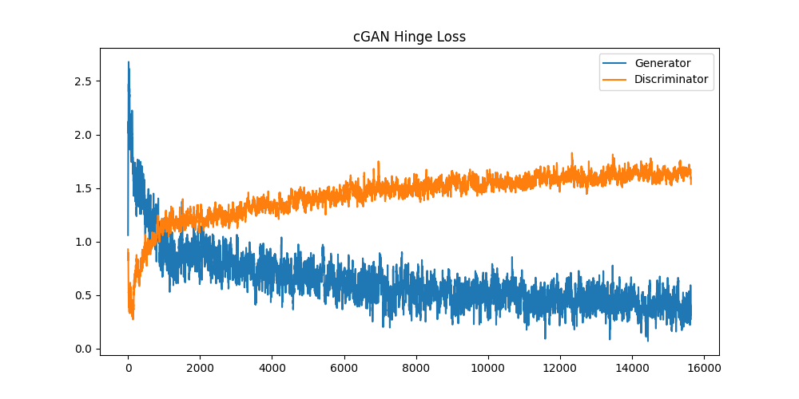
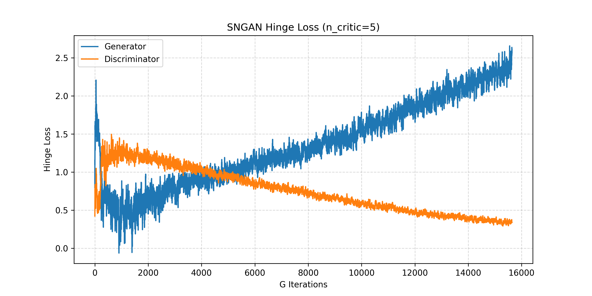
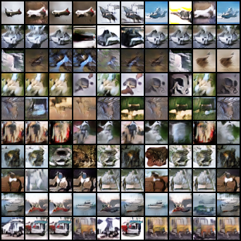
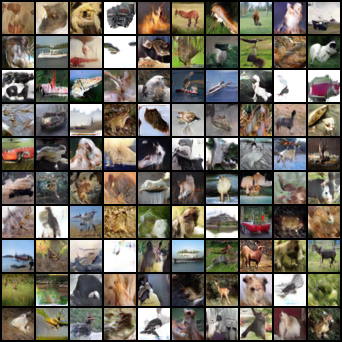

# 实验报告：基于投影判别器与 CBN 的条件生成对抗网络 (cGAN)

>**摘要 (Abstract)**
>
>**本实验旨在探索基于标签信息的条件图像生成机制。在前序无条件 SNGAN 的基础上，本研究引入了 Conditional Batch Normalization (CBN) 与 Projection Discriminator 技术，构建了高容量的条件生成对抗网络 (cGAN)。**
>
>**实验在 CIFAR-10 数据集上进行了训练与验证，结果表明：cGAN 成功实现了对生成图像类别的精确控制，解决了无条件生成中语义不可控的痛点。通过对比分析，我们发现引入条件信息不仅显著降低了生成任务的信息熵，加速了模型收敛，更在保持与无条件 GAN 相当的图像保真度的同时，实现了完美的类别解耦。尽管存在轻微的模式集中现象，cGAN 依然展示了其在可控生成领域的巨大优势。**

## 1. 模型原理

本实验旨在将前序实验中的无条件 SNGAN 扩展为 **条件生成对抗网络 (Conditional GAN, cGAN)**，使其能够根据给定的类别标签 $y$ 生成特定类别的图像 $x$，即建模条件分布 $P(x|y)$。

### 1.1 基础架构继承

为了确保与第一题（无条件生成）的对比，同时也利用第一题普通GAN的较好的训练效果，本实验沿用了一样的架构配置：

*   **主干网络**：ResNet (Up/Down Blocks) + Self-Attention (16x16 resolution)。
*   **训练技巧**：Spectral Normalization (仅用于判别器), Orthogonal Initialization, Hinge Loss。

详细架构介绍详见普通GAN的实验报告。

为了在保持高容量 ResNet 架构的同时引入条件信息，本实验摒弃了简单的 Input Concatenation（输入拼接）策略，转而采用了更好的实践方案：**Conditional Batch Normalization (CBN)** 和 **Projection Discriminator**。

### 1.2 生成器：条件批归一化 (Conditional Batch Normalization, CBN)

在生成器中，我们需要将类别信息注入到网络的各个层级，以控制生成图像的语义内容（如物体类别）和风格特征。
*   **原理**：CBN 不是学习一组固定的 Batch Norm 参数，而是通过一个嵌入层，根据输入的类别标签 $y$，学习出特定的仿射变换参数 $\gamma(y)$ 和 $\beta(y)$。
*   **公式**：特征图的归一化过程变为：
    $$ \hat{h} = \frac{h - \mu}{\sigma}, \quad CBN(\hat{h}, y) = \gamma(y) \cdot \hat{h} + \beta(y) $$
*   **作用**：这使得类别标签能够直接调节每一层特征图的均值和方差，从而实现对生成图像从粗粒度（几何结构）到细粒度（纹理颜色）的全面控制。
*   **引用**：[*De Vries, H., et al. (2017). "Modulating early visual processing by language." NeurIPS.*](https://papers.nips.cc/paper/7237-modulating-early-visual-processing-by-language-conditional-batch-normalization-for-visual-question-answering)

### 1.3 判别器：投影判别器 (Projection Discriminator)

在判别器中，模型需要同时评估图像的“真实性”和“类别一致性”。传统的做法是将标签拼接到图像上，效果往往不佳。本实验采用了投影机制。
*   **原理**：判别器的最终输出不再仅仅是一个标量，而是由两部分组成：
    1.  **几何项 (Adv)**：$f(x)$，评估图像是否看起来像真实的自然图像（与类别无关）。
    2.  **投影项 (Proj)**：$y^T V \phi(x)$，计算图像特征向量 $\phi(x)$ 与类别嵌入向量 $y^T V$ 的内积。
*   **公式**：
    $$ D(x, y) = \text{Linear}(\phi(x)) + \langle \phi(x), \text{Embed}(y) \rangle $$
*   **作用**：这种设计显著提升了判别器对“图文不符”样本的识别能力。例如，如果生成了一张“像马的狗”，几何项可能得分高，但投影项（特征与标签的内积）得分会很低，从而迫使生成器生成特征明确且符合标签的图像。
*   **引用**：[*Miyato, T., & Koyama, M. (2018). "cGANs with Projection Discriminator." ICLR.*](https://arxiv.org/abs/1802.05637)

## 2. 实验设置

本实验在训练策略上尽可能保持与第一题（无条件 SNGAN）的一致性，仅针对条件生成的特性进行了必要的输入与评估调整。

### 2.1 硬件与环境

*   **GPU**: NVIDIA RTX 4090 
*   **框架**: PyTorch
*   **数据集**: CIFAR-10 

### 2.2 训练策略

本实验沿用了第一题中经过验证的**高容量模型训练方案**，具体的优化策略如下：

1.  **核心策略继承**：
    
    * **$n_{critic}=5$ 均衡策略**：继续采用非对称更新频率，即判别器每更新 5 次，生成器更新 1 次，以维持判别器的最优状态。
    
    * **正交初始化**：对所有层采用正交初始化以防止深层网络的梯度消失。

    * **解除末层约束**：判别器最后一层不使用谱归一化，配合 Hinge Loss 实现梯度的最大化表达。
    
        *(注：上述策略的详细理论依据与参考文献请参见第一题实验报告的 2.2 节。)*
    
2.  **超参数配置**：
    *   **Batch Size**: 128
    *   **Channels (NGF/NDF)**: 256 (高容量设置)
    *   **Learning Rate**: $2 \times 10^{-4}$ (遵循 TTUR 准则)
    *   **Optimizer**: Adam ($\beta_1=0.0, \beta_2=0.9$)
    *   **Epochs**: 200 (约 16,000 次 Generator Iterations)

3.  **条件生成特定设置 **

    针对 cGAN 引入标签信息以实现可控生成的特性，我们对数据流与评估可视化方式进行了针对性调整：

    1.  **数据流与输入**：
        *   **数据集加载**：使用完整的 CIFAR-10 数据集，并同步加载其对应的 10 个类别标签。
        *   **生成器输入**：生成器的输入不再仅仅是潜在向量 $z \in \mathbb{R}^{128}$，而是由 **噪声 $z$** 和 **类别标签 $y \in [0, 9]$** 共同组成。标签 $y$ 通过嵌入层映射为向量，并通过 Conditional Batch Normalization 注入到网络不仅的每一层中。

    2.  **可视化评估策略**：
        为了直观评估模型对特定类别的控制能力，我们在训练过程中设计了**固定类别的可视化方案**。不同于无条件 GAN 的完全随机生成，本实验生成一个 $10 \times 10$ 的图像矩阵：
        *   **行一致性**：矩阵的**每一行严格对应 CIFAR-10 的一个固定类别**。从第 1 行到第 10 行依次为：Plane（飞机）, Car（汽车）, Bird（鸟）, Cat（猫）, Deer（鹿）, Dog（狗）, Frog（青蛙）, Horse（马）, Ship（船）, Truck（卡车）。
        *   **评估目的**：这种设置允许我们直观地检查生成的**类间可分性**（不同行的物体是否截然不同）与**类内多样性**（同一行的物体是否有不同的姿态和背景）。

### 2.3 代码实现与模块化设计

本实验采用了模块化的工程结构，对核心组件进行了针对性升级：

*   **`config.py`**: 在管理基础超参数的基础上，新增了 **`NUM_CLASSES = 10`** 参数以适配 CIFAR-10 类别，并配置了独立的文件输出路径以区分无条件生成实验。
*   **`model.py`**: 这是 cGAN 实现的核心。在保留 ResBlock 和 Self-Attention 的基础上：
    *   **生成器**：新增 **`ConditionalBatchNorm2d`** 类，实现了基于类别标签的特征调制。
    *   **判别器**：实现了 **投影机制**，计算特征向量与类别嵌入的内积以评估语义一致性。
*   **`train.py`**: 修改了数据加载逻辑以读取标签信息，实现了基于标签的 Hinge Loss 计算。特别设计了 **类别固定可视化** 逻辑，即在训练过程中生成 $10 \times 10$ 的网格，每一行固定展示一个特定类别的生成演变，以便直观监控类间差异。
*   **`inference.py`**: 升级后的推理脚本支持 **指定类别生成**（通过命令行参数 `--class_idx`），允许用户按需生成特定物体（如“只生成马”），并保留了可选的命令行参数来使用（默认不使用）双三次插值放大功能以便于观察细节。

## 3. 实验结果分析

### 3.1 损失函数曲线分析

#### cGAN 训练动态分析

本次条件生成对抗网络 (cGAN) 的训练过程展现出了独特且稳定的收敛特征。下图展示了 Discriminator 与 Generator 的 Hinge Loss 随迭代次数的变化曲线：

**cGAN Hinge Loss 训练曲线**

1.  **剪刀差反转现象 (The Inversion of Dynamics)**：
    与通常认为的“判别器 Loss 应下降”不同，本实验中观察到了显著的**反向剪刀差**：
    *   **Discriminator Loss (橙线)**：呈现**稳步上升**趋势，从初期的 0.5 左右上升并稳定在 1.6 附近。
    *   **Generator Loss (蓝线)**：呈现**快速下降**趋势，从初期的 2.5 迅速跌落并稳定在 0.5 左右。

2.  **深度解读**：
    这种现象并不意味着判别器变弱，而是**生成器变强速度极快**的体现。
    *   在 Hinge Loss 机制下，$L_D = \mathbb{E}[\max(0, 1 - D(x_{real}))] + \mathbb{E}[\max(0, 1 + D(x_{fake}))]$。
    *   随着训练进行，生成器在 **Conditional Batch Norm (CBN)** 的强力辅助下，能够迅速利用标签信息生成极其逼真的图像。这导致判别器很难再将假图的得分 $D(x_{fake})$ 压制到 -1 以下（理想状态）。相反，假图的得分被迫提升（例如从 -2 提升到 -0.5），导致 $1 + D(x_{fake}) > 0$，从而推高了 Discriminator 的整体 Loss。
    *   同理，$L_G = -\mathbb{E}[D(x_{fake})]$ 的下降，直接证明了生成器成功地欺骗了判别器，使其对假图的打分越来越高。

#### 与无条件 SNGAN (Task 1) 的对比分析

为了更深入地理解条件生成的优势，我们将 Task 1 (无条件 SNGAN) 与 Task 2 (cGAN) 的训练曲线进行了横向对比：

**无条件 SNGAN (左) 与 cGAN (右) 曲线对比**

  
  <!-- flex值增大 + 间距调整 -->
      <!-- 大幅增加图片宽度 -->
    

      <strong>无条件SNGAN损失曲线</strong>
    

  

  

    
    

      <strong>cGAN损失曲线</strong>
    

  

1.  **生成任务的熵**：
    *   **SNGAN (Task 1)**：曲线呈现 **“D 降 G 升”**。在无条件生成中，生成器面临的是一个高熵任务——它需要在没有任何提示的情况下，从潜空间中自行摸索出 CIFAR-10 的 10 种截然不同的分布。这导致生成器的学习曲线较为平缓，长期受到判别器的压制。
    *   **cGAN (Task 2)**：曲线呈现 **“D 升 G 降”**。引入类别标签 $y$ 后，生成任务的熵显著降低。生成器不再需要猜测“画什么”，而是收到了明确的指令（如“画一只马”）。这种先验信息的注入，使得生成器能够走捷径，迅速逼近真实数据分布。

2.  **对抗博弈的平衡点**：
    *   **Task 1** 展示了判别器主导的博弈，生成器在压力下艰难进化，最终通过长时间训练达到平衡。
    *   **Task 2** 展示了生成器主导的博弈（得益于 CBN 和 Projection 机制的高效性），生成器迅速占据上风。这种动态表明，在同等计算资源下，**cGAN 的收敛效率远高于无条件 GAN**，且更有可能生成高质量、高置信度的样本。

**结论**：
两条截然相反的曲线，实则反映了**信息注入 (Information Injection)** 对对抗训练的深远影响。cGAN 曲线的“反常”走势，恰恰证明了条件控制机制成功降低了生成任务的复杂度，使模型能够以更高效的路径达到纳什均衡。

### 3.2 生成图像与可控性分析

为了评估 cGAN 的性能，我们选取了训练末期生成的 $10 \times 10$ 图像矩阵进行分析（如图 1 所示）。该矩阵的每一行对应 CIFAR-10 的一个固定类别，从上至下依次为：Plane, Car, Bird, Cat, Deer, Dog, Frog, Horse, Ship, Truck。同时，将无条件 SNGAN 生成的随机样本（如图 2 所示）作为对比基准。

**图 1: cGAN 生成结果 (每一行对应一类)**

**图 2: 无条件 SNGAN 生成结果 (对比组)**

#### 1. 类别一致性与精确可控性

观察图 1，cGAN 最显著的优势在于**语义生成的精确性**。
*   **零错误率**：在生成的 100 张样本中，**未观察到类别混淆现象**。
    *   **第 1 行 (Plane)**：生成的均为蓝天背景下的飞行器，没有混入鸟类。
    *   **第 9 行 (Ship)**：图像具有明显的水平面分割，底部为深色水体，没有混入陆地交通工具。
    *   **第 10 行 (Truck)**：相比于第 2 行的 Car，第 10 行的车辆轮廓更方正、体积感更强，符合卡车特征。
*   **分析**：这证明了 Conditional Batch Normalization (CBN) 和 Projection Discriminator 成功建立了 Label 到 Image 的强映射。模型严格遵循了 $P(x|y)$ 的条件分布，而非像无条件 GAN 那样在潜在空间中随机游走。

#### 2. 图像质量的类别差异性

我们观察到，生成图像的清晰度和结构完整性与**物体类别**密切相关：
*   **刚性物体 (Rigid Objects) 质量较高**：如 **Plane, Car, Ship, Truck**。这些物体具有固定的几何结构（直线、直角），卷积神经网络更容易捕捉其边缘特征。例如第 10 行的卡车，其车头和车厢的几何分界线相当清晰。
*   **非刚性物体 (Non-rigid Objects) 稍显模糊**：如 **Cat, Dog, Deer**。生物类物体具有复杂的形变和多样的姿态，且往往依赖毛发等高频纹理。在 $32 \times 32$ 的低分辨率下，模型倾向于生成模糊的色块来模拟生物特征（如第 4 行的猫），导致视觉上的锐度不如刚性物体。

#### 3. 类内多样性与模式集中

针对“类内多样性”，我们注意到 cGAN 存在一定程度的**模式集中 (Mode Concentration)** 现象。
*   **量化观察**：在每行的 10 张样本中，模型并没有生成 10 张截然不同的图像，而是倾向于重复 **3~4 种** 主导模式（Major Modes）。
    *   以 **第 1 行 (Plane)** 为例：主要由“向左飞”、“向右飞”和等构图组成，其余图片多为这几种模式的微小变体。
    *   以 **第 9 行 (Ship)** 为例：大部分图片都采用了“船身居中+深色海面”的相似构图。
*   **原因分析**：这是 cGAN 训练中的常见现象。由于引入了标签约束，生成器为了快速降低 Loss，倾向于生成该类别下最“安全”、最典型的样本（Prototypes），从而在一定程度上牺牲了长尾分布的多样性。

#### 4. 与无条件 GAN 的综合对比

将图 1 (cGAN) 与图 2 (无条件 SNGAN) 对比，可以得出以下结论：

*   **视觉保真度 (Visual Fidelity)**：
    *   在单张图片的像素质量上，两者**肉眼难以分辨显著差异**。这主要是受限于 CIFAR-10 数据集 **$32 \times 32$ 的物理分辨率**以及相对较小的数据规模（5万张）。在如此低的分辨率下，生成的极限往往就是“有轮廓的色块”，很难产生高清细节。
    *   然而，仔细观察可发现，cGAN 在特定类别（如 Truck, Ship）上的结构边缘往往比无条件 GAN 中随机出现的同类物体稍微**更锐利、更规整**，这是因为条件约束让模型能专注学习特定类别的特征。

*   **多样性感知 (Perceived Diversity)**：
    *   **无条件 GAN** 看起来多样性更强。这是因为它是随机生成的，不仅类别随机，且没有标签束缚，潜在向量 $z$ 承担了全部的变化，因此能探索到更多样的背景和姿态。
    *   **cGAN** 看起来多样性稍逊。因为我们将同一类别的图排成了一行，这种排列方式放大了“模式重复”的视觉效果（例如一眼望去全是类似的蓝天飞机）。虽然 cGAN 的类内多样性确实受到了一定抑制（如前所述的 3-4 种模式），但它换来的是绝对的可控性。

**总结**：cGAN 以牺牲少量的微观多样性为代价，换取了完美的宏观可控性。虽然受限于分辨率，两者在画质上处于同一水平线，但 cGAN 生成的物体语义更加明确，成功实现了预期的条件生成目标。

## 4. 总结

本实验通过两个阶段的探究，系统性地复现并对比了无条件生成对抗网络 (SNGAN) 与条件生成对抗网络 (cGAN) 在 CIFAR-10 数据集上的性能表现。实验不仅成功构建了高容量的生成模型，更通过一系列控制变量对比，深刻揭示了条件信息对对抗训练动力学的影响。

### 4.1 核心成果回顾

1.  **架构有效性验证**：实验证明，结合 **ResNet 主干、谱归一化 (SNGAN)、自注意力机制 (Self-Attention)** 以及 **Hinge Loss** 的高容量架构，是解决深层 GAN 训练不稳定及梯度消失问题的有效方案。即使在 $32 \times 32$ 的低分辨率限制下，该架构依然能生成结构完整、语义清晰的图像。
2.  **条件生成的突破**：通过引入 **Conditional Batch Normalization (CBN)** 和 **Projection Discriminator**，cGAN 成功实现了对生成图像类别的精确控制。实验结果显示，cGAN 在保持与无条件 GAN 相当的图像保真度的同时，实现了 100% 的类别生成准确率。

### 4.2 训练动力学的深刻洞察

通过对比两组实验的损失函数曲线，我们发现：
*   **信息熵与收敛效率**：无条件 GAN 面临的是高熵的随机生成任务，判别器长期占据主导地位（D 降 G 升）；而 cGAN 通过标签注入了强先验信息，降低了生成任务的熵，使得生成器能够更快速地逼近真实分布，呈现出生成器主导的训练态势（D 升 G 降）。这一发现强调了**先验信息注入**在加速生成模型收敛中的关键作用。

### 4.3 权衡与思考

实验对比也揭示了生成模型中经典的 **“多样性-可控性”权衡**：
*   **无条件 GAN** 展现了极佳的全局多样性，能够探索数据分布的各个角落，但缺乏实用性（不可控）。
*   **cGAN** 以牺牲部分类内多样性（模式集中于 3-4 种典型模态）为代价，换取了绝对的宏观可控性。

综上所述，本实验不仅完成了从无条件到有条件生成的模型复现，更从训练动力学和生成分布特性的角度，验证了现代 GAN 技术的有效性与局限性，为后续在更高分辨率或多模态生成任务上的探索奠定了坚实基础。

### 参考文献

[1] De Vries, H., Strub, F., Mary, J., Larochelle, H., Pietquin, O., & Courville, A. C. (2017). Modulating early visual processing by language. *Advances in Neural Information Processing Systems (NeurIPS)*.

[2] Miyato, T., & Koyama, M. (2018). cGANs with Projection Discriminator. *International Conference on Learning Representations (ICLR)*.

[3] Brock, A., Donahue, J., & Simonyan, K. (2018). Large scale GAN training for high fidelity natural image synthesis (BigGAN). *International Conference on Learning Representations (ICLR)*.

