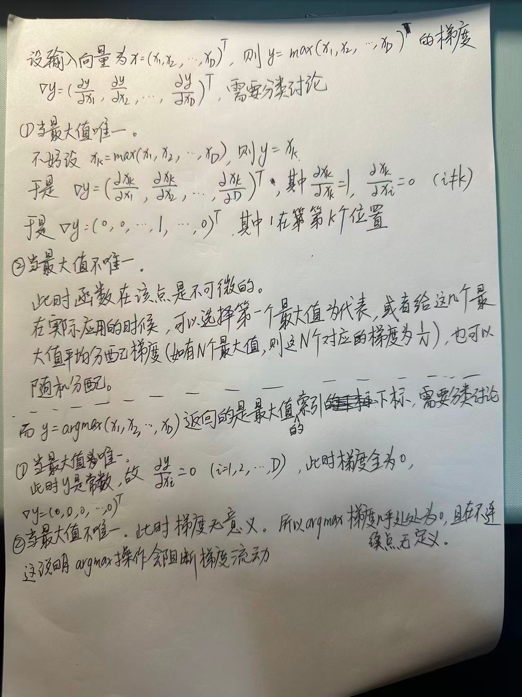
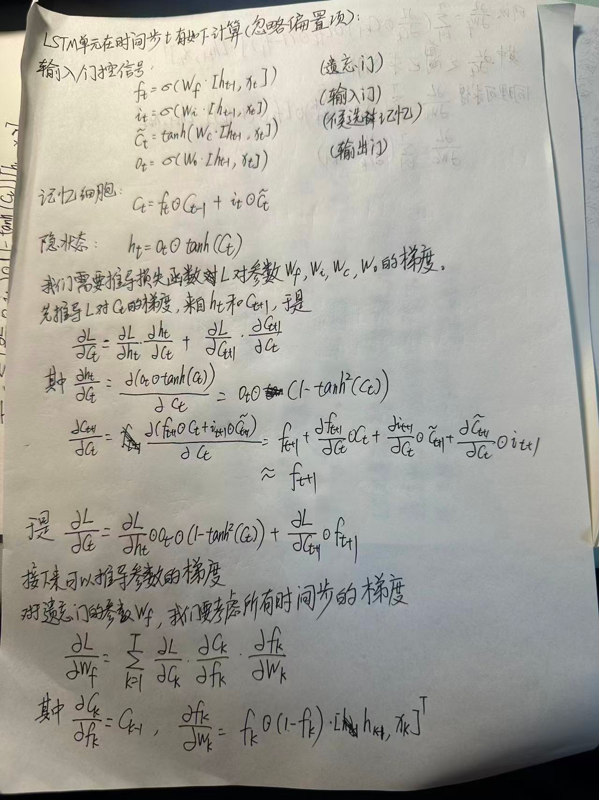

# Assignment6

## A6.1 

### Q

分析卷积神经网络中用1×1的卷积核的作用，试分析大的卷积核和小的卷积核各自的优缺点。

### A

### 1×1 卷积核的作用

1×1 卷积核最早在 **Network in Network**（NiN）论文中被明确提出，其本质是对特征图的通道维度进行**线性变换**，而不改变空间维度（高度和宽度）。

#### 1. **通道维度的升维与降维**（Dimensionality Manipulation）

- 1×1 卷积可以减少或增加通道数，从而控制模型容量和计算量。
- 例如：将 256 通道的特征图通过 1×1 卷积压缩为 64 通道，再送入较昂贵的 5×5 卷积，可显著降低计算成本。

#### 2. **计算效率提升**（Computational Efficiency）

- 在 Inception 模块中，1×1 卷积作为**瓶颈层**（bottleneck），在应用大卷积核（如 5×5）前先降维，大幅减少参数和浮点运算量 。
- GoogleNet（Inception v1）论文明确指出，1×1 卷积的引入是为了“**keep the computational cost maintainable**” 。

#### 3. **引入非线性**

- 尽管卷积核空间尺寸为 1，但配合激活函数（如 ReLU），1×1 卷积仍可实现通道间的**非线性特征融合**，增强模型表达能力 。

#### 4. **实现跨通道信息交互**

- 标准卷积在局部空间窗口内融合通道信息，而 1×1 卷积则在**每个空间位置独立地融合所有通道**，相当于对通道进行“注意力式”的重加权。

总结：1×1 卷积是一种**轻量级的通道变换工具**，在不损失空间信息的前提下，实现维度压缩、非线性增强和计算优化。

### 小卷积核与大卷积核对比

#### （1）小卷积核的优势

#####  **参数更少、计算量更低**

- 两个堆叠的 3×3 卷积在感受野上等效于一个 5×5 卷积，但参数量从 $25C^2$ 降至 $2 \times 9C^2 = 18C^2$（$C$ 为通道数）。

#####  **更深的网络、更强的非线性表达**

- 多个小卷积层之间可插入多个非线性激活函数（如 ReLU），比单个大卷积核具有更强的非线性拟合能力 。

#####  **缓解过拟合，提升泛化**

- 小核结构天然具有更强的正则化效应，配合深度堆叠，已成为现代 CNN（如 VGG、ResNet）的标准设计 。

#####  **灵活构建任意感受野**

- 通过堆叠，可灵活控制感受野大小，而不受固定大核的限制。

#### （2）小卷积核的缺点

#####  **感受野增长缓慢**

- 单层 3×3 卷积感受野仅为 3，需多层堆叠才能达到大核的覆盖范围，可能影响对**全局上下文**的建模能力。

#####  **对长距离依赖建模能力弱**

- 在需要建模大范围空间关系的任务（如语义分割、目标检测）中，纯小卷积网络可能表现受限。

#### （3）大卷积核的优势

#####  **更大的感受野（Receptive Field）**

- 单层即可捕获更大范围的空间上下文信息，有利于建模**全局结构**和**形状偏好** 。

#####  **更强的局部模式捕捉能力**

- 对于纹理复杂或结构稀疏的任务（如医学图像、遥感图像），大核能一次性整合更多邻域信息 。

#####  **在某些任务中性能更优**

- 最新研究表明，在 Vision Transformer 崛起的背景下，**大核 CNN**（如 ConvNeXt、RepLKNet）通过使用 7×7 甚至 31×31 的卷积核，可在 ImageNet 等任务上媲美或超越 Transformer 。

#### （4）大卷积核的缺点

#####  **参数量和计算量急剧增加**

- 7×7 卷积的参数量是 3×3 的 $(7/3)^2 \approx 5.4$ 倍，若通道数高，将导致模型臃肿。

#####  **易过拟合**

- 在数据有限时，大核引入过多自由度，容易过拟合 。

#####  **训练不稳定**

- 大核对初始化和学习率更敏感，优化难度更高。

现代卷积神经网络通常结合大小卷积核的优势：一方面沿用堆叠小卷积核（如 3×3）的高效设计（如 VGG、ResNet），通过深度结构获得大感受野；另一方面，在关键模块中引入大卷积核（如 7×7 或更大，见 ConvNeXt、RepLKNet）以增强全局上下文建模能力；同时，广泛使用 1×1 卷积进行通道压缩与特征融合（如 Inception 系列），并在新型架构中融合注意力机制（如 LKCA），在计算效率、表达能力和感受野之间取得更好平衡。

## A6.2

### Q

计算函数$𝑦 = max(𝑥_1,⋯,𝑥_𝐷)$和函数$𝑦 = argmax(𝑥_1,⋯,𝑥_𝐷)$的梯度。

### A

**这让我联想到了现代大语言模型中的MoE Router的问题。选择专家的路由也是离散的（当Top-k的k取1时就变成argmax），这会阻断梯度反向传播，使得路由的权重无法得到有效的训练，导致专家负载不均衡的问题。而一个有效的解决方法是使用softmax+添加一个辅助的负载均衡损失，目的是通过辅助损失函数的梯度（因为softmax是可导的），惩罚 Router，不允许它总是把流量分给同一个专家，有效地训练到路由的权重。**

## A6.3

### Q

推导LSTM网络中参数的梯度，并分析其避免梯度消失的效果。

### A

## A6.4

### Q

当将自注意力模型作为神经网络的一层使用时，分析它和卷积层以及循环层在建模长距离依赖关系的效率和计算复杂度方面的差异。   

### A

定义如下变量：
*   $n$：序列长度（Sequence Length）。
*   $d$：表示维度（Representation Dimension / Hidden Size）。
*   $k$：卷积核大小（Kernel Size，仅用于卷积层）。

我将从计算复杂度、序列操作的并行度以及最大路径长度三个维度进行分析。其中“最大路径长度”是衡量建模长距离依赖能力的关键指标，指的是网络中任意两个位置的信号进行交互所需经过的非线性变换或连接的步数。步数越短，梯度传播越容易，捕捉长距离依赖的能力越强。

### 1. 自注意力层 (Self-Attention)

自注意力机制允许序列中的每个位置直接关注序列中的其他所有位置。

#### 1.1 计算复杂度

在自注意力层中，我们需要计算 Query ($Q$)、Key ($K$) 和 Value ($V$) 矩阵，然后计算注意力分数并加权求和。
公式大致如下：
$$ \text{Attention}(Q, K, V) = \text{softmax}\left(\frac{QK^T}{\sqrt{d_k}}\right)V $$
假设 $Q, K, V \in \mathbb{R}^{n \times d}$。
1.  计算 $QK^T$（$n \times d$ 乘 $d \times n$）：复杂度为 $O(n^2 d)$。
2.  计算注意力权重与 $V$ 的乘积（$n \times n$ 乘 $n \times d$）：复杂度为 $O(n^2 d)$。
3.  线性投影（$W_Q, W_K, W_V$）：复杂度为 $O(n d^2)$（假设输入输出维度均为 $d$）。

**总复杂度：** $O(n^2 d)$
*注：如果 $n \ll d$，这一项较小；但对于长序列（$n$ 很大），$n^2$ 项占主导，计算量非常大。*

#### 1.2 长距离依赖（最大路径长度）
在自注意力机制中，第 1 个词和第 $n$ 个词之间的连接是直接的。无论序列多长，任意两个位置之间的信号只需要经过一次注意力操作。
**最大路径长度：** $O(1)$

### 2. 循环层 (Recurrent Layer / RNN)

RNN 依次处理序列，当前隐藏状态依赖于前一时刻的隐藏状态。
$$ h_t = f(h_{t-1}, x_t; W) $$

#### 2.1 计算复杂度
在每一个时间步 $t$（共 $n$ 步）：
我们需要将输入 $x_t$ ($1 \times d$) 和 $h_{t-1}$ ($1 \times d$) 与权重矩阵 ($d \times d$) 相乘。
单步计算量为 $O(d^2)$。

**总复杂度：** $O(n d^2)$
*注：这是关于序列长度 $n$ 的线性复杂度，通常比自注意力层的 $O(n^2 d)$ 更节省计算资源（当 $n > d$ 时）。*

#### 2.2 长距离依赖（最大路径长度）
为了让序列末尾的位置 $x_n$ 获取序列开头 $x_1$ 的信息，信号必须穿过中间所有的 $n-1$ 个隐藏状态 $h_2, \dots, h_{n-1}$。
这意味着梯度或信息需要经过 $n$ 次非线性变换。这正是导致梯度消失/爆炸以及难以捕捉长距离依赖的原因。
**最大路径长度：** $O(n)$

### 3. 卷积层 (Convolutional Layer)

这里指一维卷积（1D CNN）。卷积核在序列上滑动，每次查看窗口大小为 $k$ 的局部区域。

#### 3.1 计算复杂度
对于序列中的每一个位置（共 $n$ 个），我们需要执行一次卷积核运算。
卷积核大小为 $k$，输入输出通道数均为 $d$。
单次卷积运算（点积）的复杂度为 $O(k \cdot d^2)$。

**总复杂度：** $O(k \cdot n \cdot d^2)$
*注：通常 $k$ 很小（如 3 或 5），所以复杂度近似看作 $O(n d^2)$，与 RNN 类似。*

#### 3.2 长距离依赖（最大路径长度）

一个标准的卷积层只能捕捉距离为 $k$ 以内的依赖。为了捕捉距离为 $l$ 的依赖，需要堆叠多个卷积层。
每增加一层，感受野（Receptive Field）增加 $k-1$。因此覆盖整个长度 $n$ 需要堆叠的层数为 $O(n/k)$。
**最大路径长度：** $O(n/k)$ 

### 对比表格

| 神经网络层类型      | 每一层的计算复杂度 | 序列操作并行度    | **最大路径长度 (长距离依赖效率)** |
| :------------------ | :----------------- | :---------------- | :-------------------------------- |
| **Self-Attention**  | $O(n^2 d)$         | $O(1)$ (高度并行) | $\mathbf{O(1)}$ (最优)            |
| **Recurrent (RNN)** | $O(n d^2)$         | $O(n)$ (无法并行) | $O(n)$ (最差)                     |
| **Convolutional**   | $O(k n d^2)$       | $O(1)$ (高度并行) | $O(n/k)$ (中等)                   |

### 总结分析

1.  **长距离依赖建模效率**：
    *   **自注意力层优势**：这是 Transformer 成功的核心原因。因为路径长度为 $O(1)$，模型可以极其容易地学习到相隔很远的词之间的关系，而不会像 RNN 那样在长路径传输中丢失信息。
    *   **RNN 的劣势**：$O(n)$ 的路径长度不仅意味着梯度难以传播，也意味着在推理时，前面的信息必须经过多次压缩才能到达后面，容易造成“遗忘”。

2.  **计算复杂度与序列长度的权衡**：
    *   当序列长度 $n$ 远小于表示维度 $d$ 时（短文本），自注意力层的 $O(n^2 d)$ 计算代价是可以接受的，甚至比 RNN 的 $O(n d^2)$ 更快。
    *   当序列长度 $n$ 非常大时（例如长文档处理，图像像素序列），自注意力层的 $n^2$ 复杂度会成为瓶颈。这时通常需要使用线性注意力机制（Linear Attention）或限制注意力窗口（如 Sliding Window Attention）来优化。

3.  **并行计算**：
    *   RNN 必须等待 $t-1$ 算完才能算 $t$，无法利用 GPU 的并行能力，训练速度慢。
    *   CNN 和 Self-Attention 都可以矩阵化并行计算，训练速度通常远快于 RNN。
