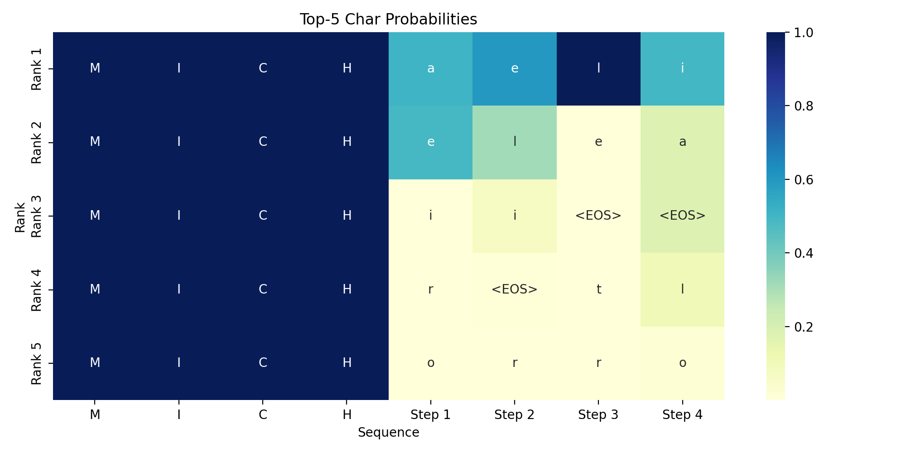
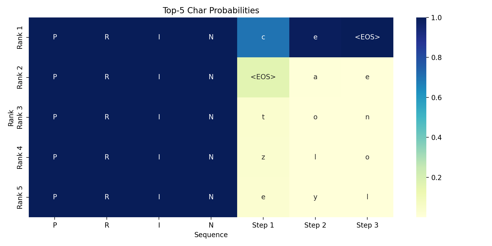
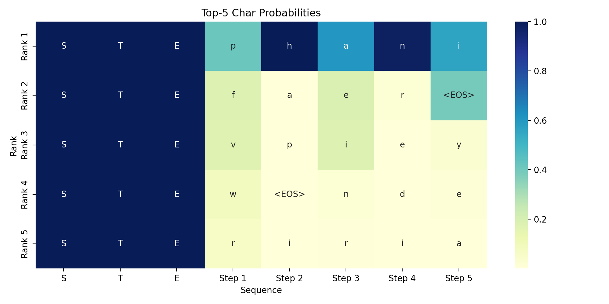
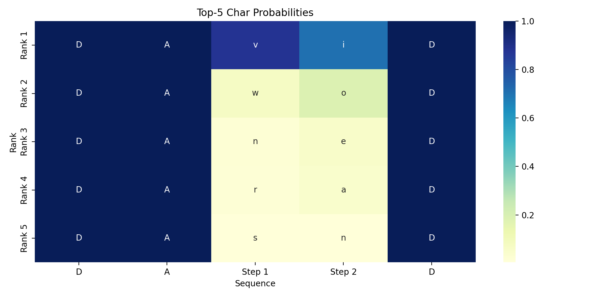
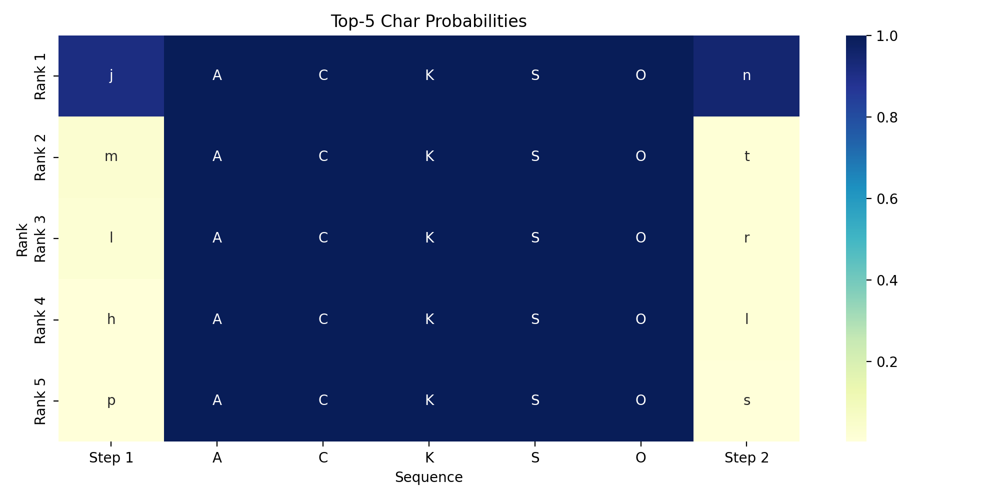
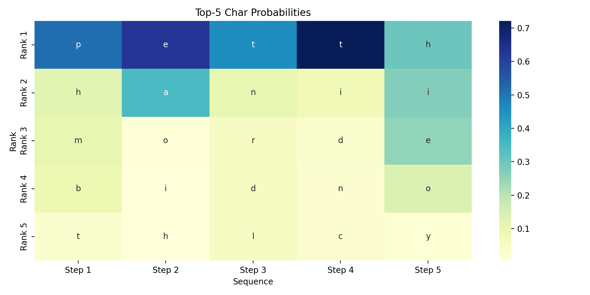

# 实验报告：基于字符级 RNN 的名字生成与补全任务

## 实验任务

本实验旨在通过循环神经网络（RNN）实现两个任务：

### 任务 1：名字生成

- **目标**：输入名字的前几个字母，生成后续字母，直到生成结束符 `<EOS>`。
- **可视化**：绘制模型在每个时间步预测的前 5 个最可能候选字母的概率分布。

### 任务 2（附加题）：名字补全
- **目标**：输入部分名字（包含缺失字符 `_`），实现任意方式补全完整名字。
- **可视化**：绘制模型在补全过程中每个时间步的预测分布，并展示最终补全结果的概率分布。

## 实验数据

### 数据集概况
- **数据来源**：`data/names.txt`，包含 8000+ 个常见英文名字。
- **数据规模**：每行一个名字，涵盖男性名、女性名等多种类型。

### 数据预处理

数据预处理过程在 `common.py` 中的 `Vocabulary` 类中实现：

1. **文本标准化**：
   - 所有名字统一转为小写，便于统一处理。
   - 仅保留英文字母 `a-z`，去除空行和特殊字符。
   - 通过 `encode()` 方法将文本转换为字符索引序列。

2. **词表与特殊标记设计**：
   - `<PAD>`（填充符，索引 0）：用于将不等长的序列填充至固定长度（本实验中为 16）。
   - `<SOS>`（起始符，索引 1）：标记序列开始，仅用于任务 1 的输入。
   - `<EOS>`（结束符，索引 2）：标记序列结束，用于任务 1 的目标序列和推理停止条件。
   - `<MASK>`（掩码符，索引 3）：标记缺失位置，用于任务 2 的掩码数据。
   - 字符映射：`a-z` 分别映射到索引 4-29，共 26 个字母。
   - 词表总大小：30（4 个特殊标记 + 26 个字母）。

3. **编码与解码**：
   - `encode(text)` 方法：将字符串转换为索引列表，例如 "alice" → [4, 5, 9, 3, 8]（对应 a, l, i, c, e）。
   - `decode(idxs)` 方法：将索引列表转换回字符串，自动跳过特殊标记和填充符。

## 实验方法

### 模型设计

#### 模型架构

- **模型结构**：`CharGRU`
  - **嵌入层**：`nn.Embedding(vocab_size=30, embedding_dim=32)`
    - 将字符索引映射为 32 维稠密向量表示。
    - 相比 one-hot 编码，大幅减少参数量，加速计算。
  - **GRU 层**：`nn.GRU(input_size=32, hidden_size=128, bidirectional=bool)`
    - 单向 GRU（任务 1）：从左到右扫描序列，模仿自然的字符生成过程。
    - 双向 GRU（任务 2）：同时从左到右和从右到左扫描序列，充分利用上下文信息。
    - 隐层维度为 128，双向时输出维度为 256。
  - **全连接层**：`nn.Linear(128 or 256, vocab_size=30)`
    - 单向时输入维度为 128，双向时为 256。
    - 将 GRU 隐状态映射到字符概率分布。
    - 动态处理维度变化，根据 `bidirectional` 参数自动调整。

### 数据集设计

#### 任务 1：GenerationDataset（生成任务）

数据处理逻辑：
```
原始名字：  "alice"  
编码：     [4, 15, 12, 6, 8]  (a=4, b=5, c=6, d=7, e=8, ..., i=12, ..., l=15)

输入序列 (X)：  [<SOS>, a, l, i, c, e]  → [1, 4, 15, 12, 6, 8]  
目标序列 (Y)：  [a, l, i, c, e, <EOS>]  → [4, 15, 12, 6, 8, 2]

填充到长度 16：  
X: [1, 4, 15, 12, 6, 8, 0, 0, 0, 0, 0, 0, 0, 0, 0, 0]  
Y: [4, 15, 12, 6, 8, 2, 0, 0, 0, 0, 0, 0, 0, 0, 0, 0]
```

- **输入**：以 `<SOS>` 开头，后接原始名字的字符序列。
- **输出**：原始名字的字符序列，末尾加上 `<EOS>`。
- **长度处理**：超出 16 个字符的名字截断，不足的部分用 `<PAD>` 补齐。

#### 任务 2（附加题）：MaskedDataset（补全任务）

数据处理逻辑：
```
原始名字： "victor"
编码： [25, 12, 6, 23, 18, 21] (a=4, b=5, c=6, ..., i=12, ..., v=25)

随机掩码（约 30% 的字符）：
掩码后： [v, , c, , o, r]
编码： [25, 3, 6, 3, 18, 21]

输入序列 (X)： [25, 3, 6, 3, 18, 21, 0, 0, 0, 0, 0, 0, 0, 0, 0, 0]
目标序列 (Y)： [25, 12, 6, 23, 18, 21, 0, 0, 0, 0, 0, 0, 0, 0, 0, 0]
```

- **输入**：部分字符被随机替换为 `<MASK>` 索引（值为 3）。
- **输出**：完整的原始名字序列。
- **掩码策略**：每个样本随机选择 1~N 个位置进行掩码，掩码比例约 30%，增加训练数据的多样性。
- **长度处理**：同样截断到 16 个字符，不足补 `<PAD>`。

### 可视化设计

#### 统一可视化函数：plot_rank_heatmap

函数签名与功能：
```python
def plot_rank_heatmap(prob_matrix, filename, input_seq=None):
    # prob_matrix: 形状为 (seq_len, vocab_size) 的概率矩阵
    # filename: 图片保存的文件名（不含扩展名）
    # input_seq: 输入序列标记，已知字符为字母，推断位置为 None
```

**处理流程**：

1. **提取 Top-5**：
   - 遍历每个时间步的概率分布。
   - 找出最大的 5 个概率值及其对应的字符索引。
   - 构建两个网格：概率网格 `(5, seq_len)` 和字符网格 `(5, seq_len)`。

2. **标签生成**：
   - **X 轴标签**：
     - 已知输入位置：直接显示大写字母（如 "M", "i", "c", "h"）。
     - 推断位置：标记为 "Step 1", "Step 2" 等，表示生成或补全的步骤。
   - **Y 轴标签**：按排名显示 "Rank 1 (Top)", "Rank 2", ..., "Rank 5"。

3. **热力图生成**：
   - 使用 Seaborn 的 `heatmap` 函数绘制热力图。
   - 颜色深度表示概率大小（深蓝色 → 高概率，浅色 → 低概率）。
   - 单元格内显示对应的字符，便于直观查看预测结果。

4. **保存与释放**：
   - 保存至 `output/{filename}.png`，分辨率 200 DPI。
   - 关闭图表，释放内存。

### 训练设计

#### 训练流程

1. **数据加载**：
   - 使用 `DataLoader` 加载数据集，批大小为 32。
   - 启用 `shuffle=True` 增加训练的随机性。

2. **损失函数与优化器**：
   - **损失函数**：`CrossEntropyLoss(ignore_index=0)`
     - 计算模型预测与目标的交叉熵损失。
     - **关键特性**：忽略 `<PAD>` 的损失，防止填充影响训练效果。
   - **优化器**：`AdamW`，学习率 0.001，权重衰减 0.01
     - 自适应学习率调整，收敛速度快。
     - 权重衰减有助于防止过拟合。

3. **训练循环**：
   - 训练 100 个 epoch，每 10 个 epoch 输出一次损失。
   - 每个 epoch 遍历所有数据，计算损失并反向传播。
   - 模型权重保存至 `output/task1.pth` 或 `output/task2.pth`。

4. **收敛情况**：
   - **任务 1**：初始损失约 2.0，最终损失约 1.41。
   - **任务 2**：初始损失约 0.6，最终损失约 0.4。

### 推理设计

#### 推理流程与采样策略

**任务 1（生成）推理**：
1. 用户输入前缀（如 "mich"），模型编码为索引序列并加上 `<SOS>`。
2. 逐步生成字符：
   - 每步输入当前序列至模型，获得所有位置的概率分布。
   - 对最后一个位置的概率应用温度参数：`logits / temperature`。
   - 使用 `torch.multinomial()` 进行采样，而非贪心的 argmax。
   - 采样得到的字符索引追加至序列。
3. 收集每步的概率分布用于可视化。
4. 当生成 `<EOS>` 或达到最大长度时停止，解码为文本。

**任务 2（补全）推理**：
1. 用户输入包含 `_` 的名字（如 "da__d"），`_` 被替换为 `<MASK>` 索引。
2. 迭代填充：
   - 前向传播，获取所有位置的概率分布。
   - 遍历所有 `<MASK>` 位置，计算有效字符（索引 4-29）的最大概率。
   - 选择最高概率的 `<MASK>` 位置（最有把握的位置）进行填充。
   - 在该位置进行温度采样（仅在有效字符范围内），获得填充字符。
   - 重复直至所有 `<MASK>` 被填充。
3. 完成填充后，再次前向传播获取最终概率分布用于可视化。

**温度采样参数**：
- 范围：0.1 ~ 2.0，默认值 1.0。
- 效果：
  - 低温（< 1.0）：概率分布更尖锐，采样结果更确定，多样性低。
  - 高温（> 1.0）：概率分布更平缓，采样结果更随机，多样性高。

## 实验结果

### 任务 1：名字生成

#### 训练过程
- **模型**：单向 GRU（bidirectional=False）。
- **训练轮数**：100。
- **最终损失**：Loss ≈ 1.41

#### 生成示例及分析

**示例 1：生成 "Michael"**
- **输入前缀**：`"Mich"`
- **生成结果**：`"Michael"`
- **可视化**：
  
- **分析**：
  - 前 4 个字母是已知输入（M-i-c-h），显示为大写字母。
  - 后面的每一步都在图上显示了Top-5的选择，可以看到由于我们使用了不是贪心而是采样策略，最后一个位置，采样到的是`<EOS>`而不是概率最大的`i`

**示例 2：生成 "Prince"**
- **输入前缀**：`"Prin"`

- **生成结果**：`"Prince"`

- **可视化**：
  
  
- **分析**：
  
  * 前 4 个字母是已知输入（P-r-i-n），显示为大写字母。
  
  - 生成的字符 'c', 'e',`<EOS>` 都具有较高的置信度。
  - 虽然使用采样策略，但是这次的推理生成，均是采样到了概率最高的那个字符，和贪心策略一致

**示例 3：生成 "Stephen"**
- **输入前缀**：`"Ste"`

- **生成结果**：`"Stephen"`

- **可视化**：
  
  
- **分析**：

  * 前 3 个字母是已知输入（S-t-e），显示为大写字母。

  - 模型能够生成较长的名字（5 个字符），说明学习了较复杂的字符依赖关系。
  - 可以看到我们采样策略的体现，在step3处取的不是概率最大的a而是其次的e；step5处取的是概率第二大`<EOS>`而不是第一大的`i`

### 任务 2（附加题）：名字补全

#### 训练过程
- **模型**：双向 GRU（bidirectional=True）。
- **训练轮数**：100。
- **最终损失**：Loss ≈ 0.4

#### 补全示例及分析

**示例 1：补全 "da__d"**（输入两边，补全中间）

- **输入名字**：`"da__d"` (缺失 2 个中间字符)
- **补全结果**：`"david"`
- **可视化**：
  
- **分析**：
  - 第 3 和 4 位原为 `<MASK>`，补全为 'v' 和 'i'。
  - 热力图显示，位置 3 处最高概率字符为 'v'（> 0.9），位置 4 处为 'i'（> 0.8）。
  - 双向上下文的优势明显：左边有 "da"，右边有 "d"，模型准确推断出中间字符为 "vi"。

**示例 2：补全 "__evie"**（输入后缀，补全前缀）

- **输入名字**：`"__evie"` (缺失 2 个开头字符)
- **补全结果**：`"stevie"`
- **可视化**：
  
- **分析**：
  - 第 1 和 2 位补全为 's' 和 't'，使用右上下文 "evie" 进行推断。
  - 位置 1 的置信度相对较高（> 0.8），位置 2 的置信度略低（> 0.4）。

**示例 3：补全 "_ackso_"**（输入中间，补齐两边）

- **输入名字**：`"_ackso_"` (缺失开头和结尾各 1 个字符)
- **补全结果**：`"Jackson"`
- **可视化**：
  
- **分析**：
  - 开头字符 'j' 和结尾字符 'n'的补全置信度较高（> 0.85）。
  - 热力图显示，模型对中间的已知字符 "ackso" 的预测分布相对集中，说明已知部分约束了模型的推断空间。

**示例 4：补全 "`______`"**（输入5个全空白，随机生成）

- **输入名字**：`"_____"` (缺失开头和结尾各 1 个字符)
- **补全结果**：`"Perch"`
- **可视化**：

​	

**分析**：

- 随机生成，热力图显示，最大的概率分布是"Petth".
- 但是我们通过采样，生成了更多不同的类型，增加了生成的多样性和随机性，本次生成的是Perch.

## 实验分析

1. **模型性能**：
   - 模型能根据前缀生成高质量的英文名字，大多数生成结果为真实存在的常见名字。
   - 通过温度采样，可以灵活控制生成名字的多样性，低温生成稳定结果，高温增加创意。
2. **可视化特点**：
   - 热力图清晰显示每个推断位置的前 5 个候选字母，帮助理解模型的决策和采样过程。

3. **生成特点**：
   * 双向 GRU 能准确补全缺失字符。
   * 补全置信度与缺失位置有关：中间位置缺失时置信度分布没有那么集中，开头或结尾缺失时置信度相对集中。

## 实验总结

### **功能实现**：

- ✅ 成功实现了基于字符级 RNN 的英文名字生成系统，生成的名字合理且多样。
- ✅ 成功实现了基于双向 GRU 的名字补全系统，补全效果良好。
- ✅ 设计了统一的可视化框架，能清晰展示模型的预测分布和决策过程。

### **技术贡献**：

- 动态模型架构，支持单向/双向切换，便于不同任务的适配。
- 温度采样机制，灵活控制生成的确定性和多样性。
- 置信度驱动的迭代补全算法，确保补全逻辑的连贯性和准确性。
- 可视化热力图，直观展示模型预测过程，便于分析模型行为。

### **实验数据**：

- 在 8000+ 名字数据集上训练，模型收敛良好，损失稳定下降。
- 生成名字的多样性和合理性都达到预期。

### **内容上传**：
https://github.com/lxer66/NNDL_HOMEWORK

## 使用说明

### 运行步骤

1. **训练模型**：
   - 任务 1（名字生成）：
     ```bash
     python train1.py
     ```
   - 任务 2（名字补全）：
     ```bash
     python train2.py
     ```

2. **运行推理**：
   - 任务 1（名字生成）：
     ```bash
     python inference1.py
     ```
     输入示例：`al`, `mich`, `step`，输入 `quit` 退出。

   - 任务 2（名字补全）：
     ```bash
     python inference2.py
     ```
     输入示例：`da__d`, `__evie`, `_ackso_`（使用 `_` 表示缺失字符），输入 `quit` 退出。

3. **查看可视化结果**：

   * 生成的权重保存在output文件夹下

   - 所有可视化图片保存在 output 文件夹中，文件名格式：
     - `task1_{生成的名字}.png`（任务 1）
     - `task2_{补全的名字}.png`（任务 2）

## 文件结构

```
assignment7/
├── data/
│   └── names.txt           # 数据文件：8000+ 英文名字
├── output/                 # 可视化结果保存目录
│   ├── task1.pth           # 任务 1 模型权重
│   ├── task2.pth           # 任务 2（附加题） 模型权重
│   ├── task1_*.png         # 任务 1 可视化结果
│   └── task2_*.png         # 任务 2（附加题） 可视化结果
├── homework_content.md     # 作业内容说明
├── common.py               # 模型、词表、可视化函数
├── train1.py               # 任务 1 训练脚本
├── train2.py               # 任务 2（附加题） 训练脚本
├── inference1.py           # 任务 1 推理脚本
├── inference2.py           # 任务 2（附加题） 推理脚本
└── README.md               # 实验报告
```
